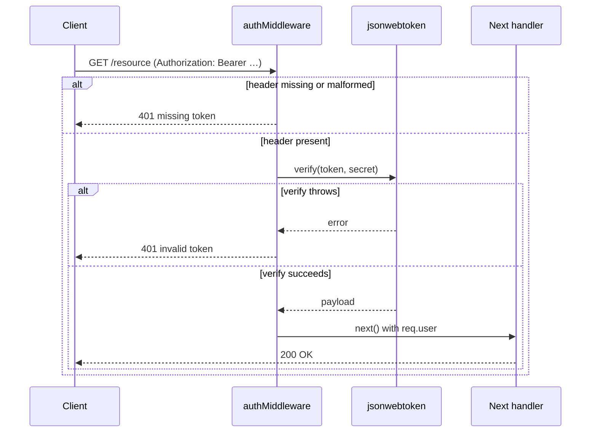

# Code Explanation Skill

When explaining code, always include these four elements:

1. **Start with an analogy**: Compare the code to something from everyday life to build intuition before diving into details.
2. **Draw a diagram**: Use ASCII art or Mermaid diagrams to show the flow, structure, or relationships between components. Prefer Mermaid for complex flows and class relationships; use ASCII art for simple, quick illustrations.
3. **Walk through the code**: Explain step-by-step what happens.
4. **Highlight a gotcha**: Call out a common mistake or misconception related to the code.

For complex concepts, use multiple analogies.

## Output Templates

Structure explanations using these sections as appropriate:

- **File/Class:** Purpose, Key Concepts, Structure, How It Works, Dependencies & Interactions, Notable Details
- **Function/Method:** Purpose, Parameters & Return Value, How It Works, Edge Cases & Error Handling, Usage
- **Directory/Module:** Purpose, Architecture, Key Files, External Interfaces, Data Flow

## Spring Boot Equivalents

When the code is not Java/Kotlin + Spring Boot, read `references/spring-boot-mapping.md` and include equivalent mappings in the explanation.

## Verify Library and Framework Usage

The model's training data has a knowledge cutoff. When explaining code that uses libraries or frameworks, **actively verify** that your explanations reflect current APIs and behavior:

1. **Identify versions** — Check `pom.xml`, `build.gradle.kts`, `package.json`, or other dependency files to determine the exact versions of libraries and frameworks in use.
2. **Look up current documentation** — Use Context7 (`mcp__claude_ai_Context7__resolve-library-id` then `mcp__claude_ai_Context7__query-docs`) to retrieve up-to-date documentation for any library or framework where:
   - The version is newer than what the model may have been trained on
   - You are unsure whether an API, configuration property, or pattern is still valid or has been deprecated/replaced
   - The code uses advanced or less common features of a library
3. **Search the web** — Use `WebSearch` and `WebFetch` to check for:
   - Breaking changes or migration guides for the specific version in use
   - Known behavioral changes between versions that affect how the code works
   - Deprecated APIs that have been replaced in newer versions
4. **Check GitHub** — Use `gh` CLI to check release notes, changelogs, or issues for dependencies when needed (e.g., `gh api repos/{owner}/{repo}/releases/latest`)

**Do not assume** that an API or pattern is correct based solely on model knowledge. When in doubt, look it up.

## Explanation Guidelines

- **Reference specific line numbers** using `file_path:line_number` format.
- **Call out design patterns** by name (e.g., "This uses the Strategy pattern to...").

## Worked Example

The following shows the four required elements applied end-to-end to a small piece of JavaScript, including the Spring Boot equivalent mapping for a Java/Kotlin reader.

**Code under explanation** (`src/middleware/auth.js:1-22`):

```js
const jwt = require('jsonwebtoken');

function authMiddleware(secret) {
  return (req, res, next) => {
    const header = req.headers.authorization;
    if (!header || !header.startsWith('Bearer ')) {
      return res.status(401).json({ error: 'missing token' });
    }
    const token = header.slice(7);
    try {
      req.user = jwt.verify(token, secret);
      next();
    } catch (err) {
      return res.status(401).json({ error: 'invalid token' });
    }
  };
}

module.exports = authMiddleware;
```

### 1. Analogy

A bouncer at a club door. Every guest (request) has to show a wristband (JWT). The bouncer doesn't know the guest personally — they just check that the wristband was issued by the venue (signed with the right secret). No wristband → turned away. Forged wristband → turned away. Valid wristband → bouncer remembers who you are (attaches `req.user`) and waves you through to the next room (`next()`).

### 2. Diagram



### 3. Walkthrough

- `auth.js:3` — `authMiddleware` is a *factory*: it takes the signing `secret` and returns the actual Express middleware. Currying lets you bind the secret once at app startup.
- `auth.js:5-8` — Pull the `Authorization` header. If it is missing or doesn't start with `Bearer `, short-circuit with 401. The early return is what makes this a guard, not a transformer.
- `auth.js:9` — `header.slice(7)` strips the literal `'Bearer '` (7 characters) to leave just the token.
- `auth.js:11` — `jwt.verify` does two jobs: it confirms the signature was produced with `secret`, and it decodes the payload. On success the payload is attached to `req.user` for downstream handlers.
- `auth.js:12` — `next()` hands control to the next middleware/handler in the Express chain. Without it, the request would hang.
- `auth.js:13-15` — Any verification error (bad signature, expired, malformed) is caught and turned into a 401 with a generic message.

### 4. Gotcha

The `catch` block swallows the original error and returns the same generic 401 for *any* failure — including expired tokens. In production you usually want to distinguish "token expired" from "token tampered" so the client can refresh; check `err.name === 'TokenExpiredError'` and respond accordingly. Also: never log the token itself in the error path.

### Spring Boot Equivalent

For a Java/Kotlin reader, the same pattern in Spring is a `OncePerRequestFilter` (or, in Spring Security, a custom `AuthenticationFilter`) that pulls the `Authorization` header, calls a `JwtDecoder`, populates the `SecurityContext`, and either continues the chain or throws a `BadCredentialsException` translated to 401 by the `ExceptionTranslationFilter`. Spring Security's `oauth2ResourceServer().jwt()` configures this end-to-end declaratively, so most apps don't write the filter by hand.
